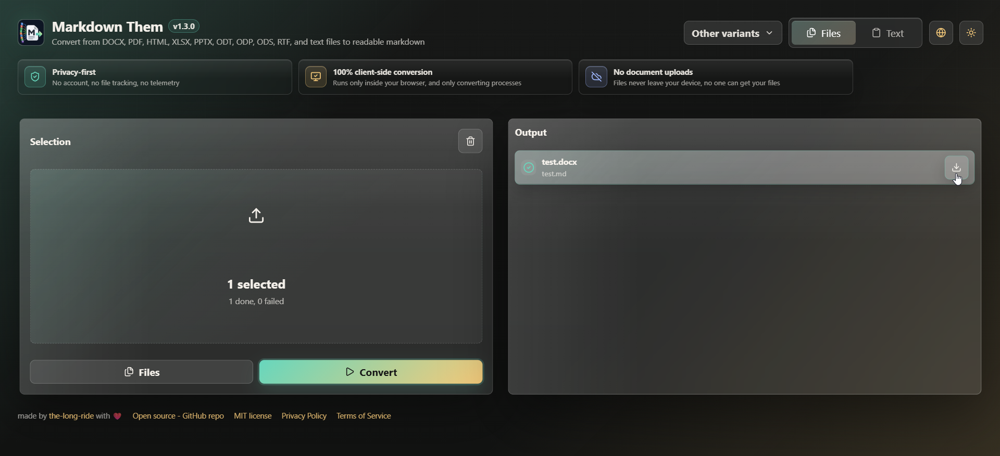
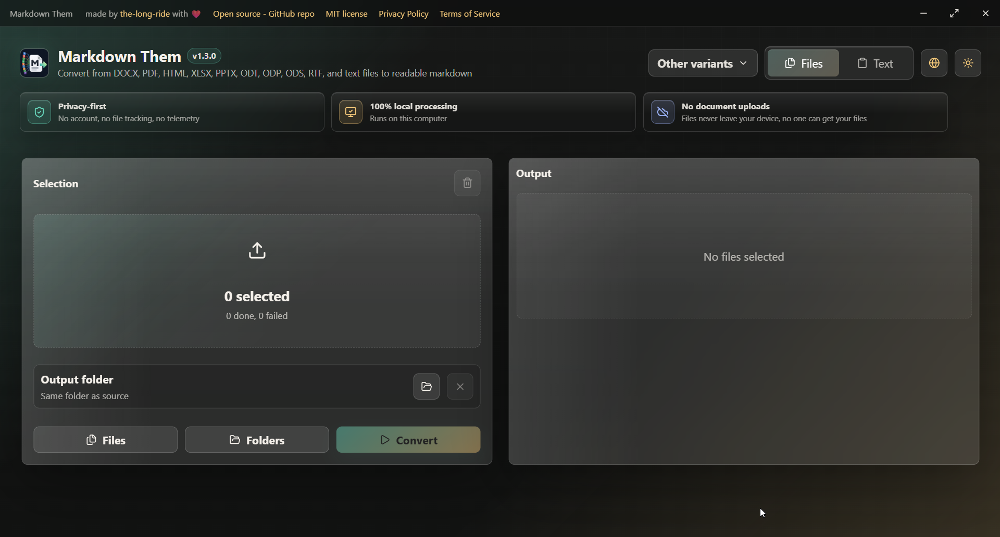

<p align="center">
  
</p>

# Markdown Them

Convertissez divers fichiers de documents en Markdown (.md) depuis une application web, une application de bureau Electron, une extension VS Code ou un package Node.js.

- **Application Web :** Convertisseur de documents uniquement côté client qui s'exécute entièrement dans votre navigateur. Hébergé et déployé directement sur GitHub Pages.
- **Application de Bureau :** Une application Electron premium pour convertir vos fichiers, dossiers et textes locaux avec des options de répertoire de sortie personnalisées. Disponible pour Windows (Portable), Linux (.AppImage, .deb) et macOS (.dmg).
- **Extension VS Code :** Intégration du menu contextuel par clic droit dans l'explorateur et d'un double volet d'aperçu Markdown pour les workflows de développement.
- **Package Node.js :** Intégrez le même moteur de conversion dans vos scripts, CLIs et automatisations personnalisés.

- **Formats pris en charge :** `.docx`, `.doc`, `.pdf`, `.html`, `.xlsx`, `.xls`, `.xlm`, `.pptx`, `.odt`, `.odp`, `.ods`, `.rtf` (Note : Les formats hérités `.doc`, `.xls`, `.xlm` utilisent une émulation de renommage et peuvent parfois ne pas se convertir correctement).
- **Traitement par lots simultané :** Convertissez des dizaines de fichiers à la fois avec des performances optimisées.

## Variantes de Markdown Them

Markdown Them est disponible en quatre variantes afin que vous puissiez utiliser le même convertisseur là où il s'intègre le mieux à votre flux de travail :

| Variante | Idéal pour | Modèle local/confidentialité | Par où commencer |
|---|---|---|---|
| **Application Web** | Conversion dans le navigateur sans installation | Client-side uniquement ; aucun chargement de document sur un serveur, pas de requêtes externes. Déployé sur GitHub Pages. | `npm run start:web` |
| **Application de bureau** | Conversion de fichiers, dossiers et textes locaux dans une interface dédiée | Application Electron exécutée sur votre ordinateur ; support du choix de dossier de sortie. Installeurs compilés pour Windows, Linux et macOS. | `npm run start:desktop` |
| **Extension VS Code** | Menu contextuel de l'Explorateur, aperçus de l'éditeur actif, workflows de développement | S'exécute localement dans VS Code sur votre machine | [VS Code Marketplace](https://marketplace.visualstudio.com/items?itemName=the-long-ride.markdown-them) ou [Open VSX](https://open-vsx.org/extension/the-long-ride/markdown-them) |
| **Package Node.js** | Scripts, CLIs, automatisation et outils côté serveur sous votre contrôle | S'exécute directement dans votre processus Node.js | [`@the-long-ride/markdown-them`](https://www.npmjs.com/package/@the-long-ride/markdown-them) |

---

## Applications de Bureau et Web

Ce dépôt comprend également le code d'interface React partagé pour l'application web locale et l'application de bureau Electron.

- **Application web :** Conversion côté client uniquement. Accepte plusieurs fichiers ou du texte, et n'envoie jamais de fichiers à un serveur externe. Déployé sur GitHub Pages.
- **Application de bureau :** Interface Electron avec contrôles de fenêtre personnalisés. Accepte du texte, un ou plusieurs fichiers, et des dossiers complets. Les fichiers convertis sont sauvegardés à côté des originaux.




### Commandes de développement local :

```bash
npm run start:web
npm run start:desktop
npm run preview:desktop
```

### Commandes de build :

```bash
npm run build:web
npm run build:desktop
npm run build:apps
```

### Build d'exécutables (Packaging) :

Générez des exécutables et installeurs prêts pour la production (Windows Portable `.exe`, Linux `.AppImage`/`.deb`, macOS `.dmg`) via `electron-builder` :

```bash
# Compiler pour Windows (Portable exe)
npm run dist:desktop:win

# Compiler pour Linux (AppImage & deb)
npm run dist:desktop:linux

# Compiler pour macOS (dmg)
npm run dist:desktop:mac

# Compiler pour toutes les plateformes
npm run dist:desktop:all
```

Les exécutables générés seront placés dans le dossier `dist/installers`.

---

## Extension VS Code

### Utilisation

#### 1. Convertir plusieurs fichiers (Lot)
1. Dans la barre latérale **Explorer** de VS Code, sélectionnez un ou plusieurs fichiers.
2. Faites un clic droit et choisissez **Convert to Markdown**.
3. Les fichiers seront convertis **simultanément** (jusqu'à la limite configurée). Vous verrez des notifications au fur et à mesure que chaque fichier est traité.

#### 2. Convertir le fichier actif
- Tout en visualisant un document, appuyez sur `Ctrl+M Ctrl+D` (ou `Cmd+M Ctrl+D` sur Mac).
- Un aperçu Markdown s'ouvrira dans un nouveau panneau à côté de votre éditeur actuel.

#### 3. Modifier la limite de traitement simultané
- Ouvrez la palette de commandes (`Ctrl+Shift+P`) et recherchez **Markdown Them: Set Max Concurrent Conversions**.
- Ou allez dans **Fichier > Préférences > Paramètres** et recherchez `Markdown Them`.

> [!NOTE]
> La conversion des fichiers `.pptx`, `.odt` et `.odp` extrait le texte structuré et les images du contenu principal sous forme de données Base64 Data URI intégrées lorsqu'elles sont disponibles. Les arrière-plans, les logos répétitifs et les petites icônes décoratives sont filtrés pour maintenir le Markdown lisible. Les fichiers `.ods` extraient les feuilles sous forme de tableaux Markdown, et le format `.rtf` préserve le style de texte standard, les titres et les puces.

#### 4. Dépannage
Si un fichier ne parvient pas à se convertir, vous pouvez afficher les journaux d'erreurs détaillés en ouvrant la commande **Developer: Toggle Developer Tools** (depuis la palette de commandes) et en consultant l'onglet **Console**.

### Configuration

| Paramètre | Type | Par défaut | Plage | Description |
|---|---|---|---|---|
| `markdown-them.maxConcurrentConversions` | `integer` | `6` | `1` – `16` | Nombre maximal de fichiers convertis simultanément lors d'une opération de traitement par lots "Convert to Markdown". |

Vous pouvez modifier ce paramètre de trois façons :

**1. Palette de commandes** — Exécutez `Markdown Them: Set Max Concurrent Conversions` (`Ctrl+Shift+P`) pour saisir une nouvelle valeur dans la boîte de dialogue.

**2. Interface des Paramètres** — Ouvrez les **Paramètres** (`Ctrl+,`) et recherchez `Markdown Them`.

**3. `settings.json`** — Ajoutez directement la clé de configuration :

```jsonc
{
  // Convertit jusqu'à 4 fichiers en même temps
  "markdown-them.maxConcurrentConversions": 4
}
```

---

## Package Node.js

À partir de la version v1.2.0, le convertisseur partagé est également distribué pour les développeurs Node.js sous le nom de package `@the-long-ride/markdown-them` :

```bash
npm i @the-long-ride/markdown-them
pnpm add @the-long-ride/markdown-them
```

```ts
import { convertFileToMarkdown, generateMarkdown } from "@the-long-ride/markdown-them";

const outputPath = await convertFileToMarkdown("./docs/report.docx");
const markdown = await generateMarkdown("./docs/report.docx");
```

### Commandes de package local :

```bash
npm run pack:vsix
npm run pack:node-package
```

Le push de tags de version déclenche automatiquement la publication du paquet sur npm. Configurez cette variable de dépôt GitHub avant de pousser vos tags `v*` :

```text
NPM_TOKEN
```

---

## Structure des Fichiers

- `src/core` : Logique de conversion partagée de documents en Markdown.
- `src/app` : Giao diện React partagée et adaptateur de conversion du navigateur.
- `src/electron` : Processus principal et pré-chargement Electron de l'application de bureau.
- `src/shared` : Métadonnées de formats et fonctions utilitaires pour les fichiers.
- `src/vscode` : Enregistrement des commandes VS Code et intégrations d'éditeur.
- `src/nodejs-package` : Point d'entrée de publication pour le module Node.js.
- `scripts` : Scripts de build et d'exécution locale.
- `nodejs-package` : Métadonnées du module, README, licence et build de distribution `dist`.

---

## Soutenu Par Des Bibliothèques Sécurisées

Nous portons une attention particulière à la sécurité et à la conformité des licences pour un usage commercial, c'est pourquoi nous avons sélectionné des bibliothèques réputées avec des licences open-source libres ou standard permissives.
Nous remercions chaleureusement les auteurs et contributeurs de ces incroyables projets :

- [`react`](https://github.com/facebook/react) / [`react-dom`](https://github.com/facebook/react) (Licence MIT) : Structure de l'interface interactive.
- [`gsap`](https://github.com/greensock/GSAP) / [`@gsap/react`](https://github.com/greensock/react) (Licence Standard GreenSock) : Animations de transition de page premium.
- [`lucide-react`](https://github.com/lucide-icons/lucide) (Licence ISC) : Icônes élégantes pour l'interface.
- [`mammoth`](https://github.com/mwilliamson/mammoth.js) (Licence BSD-2-Clause) : Conversion robuste des documents `.docx`.
- [`@opendocsg/pdf2md`](https://github.com/opendocsg/pdf2md) (Licence MIT) : Extraction de texte fiable des fichiers `.pdf`.
- [`jszip`](https://github.com/Stuk/jszip) (Licence MIT ou GPL-3.0) : Décompression des fichiers zip.
- [`fast-xml-parser`](https://github.com/NaturalIntelligence/fast-xml-parser) (Licence MIT) : Analyseur XML léger pour les documents Office.
- [`turndown`](https://github.com/mixmark-io/turndown) (Licence MIT) : Conversion propre du contenu HTML en Markdown.
- [`officeparser`](https://github.com/harshankur/officeParser) (Licence MIT) : Extracteur de texte alternatif pour les fichiers Office/OpenDocument atypiques.

---

## Crédits & Liens
[VS Code Marketplace](https://marketplace.visualstudio.com/items?itemName=the-long-ride.markdown-them) 
| [Open VSX](https://open-vsx.org/extension/the-long-ride/markdown-them) 
| [Dépôt sur GitHub](https://github.com/the-long-ride/markdown-them) 
| [Journal des modifications](https://github.com/the-long-ride/markdown-them/blob/main/CHANGELOG.md) 
| [Guide de contribution](https://github.com/the-long-ride/markdown-them/blob/main/GUIDELINE.md)

## Licence
[Licence MIT (avec restrictions d'utilisation du thème)](https://github.com/the-long-ride/markdown-them/blob/main/LICENSE)
